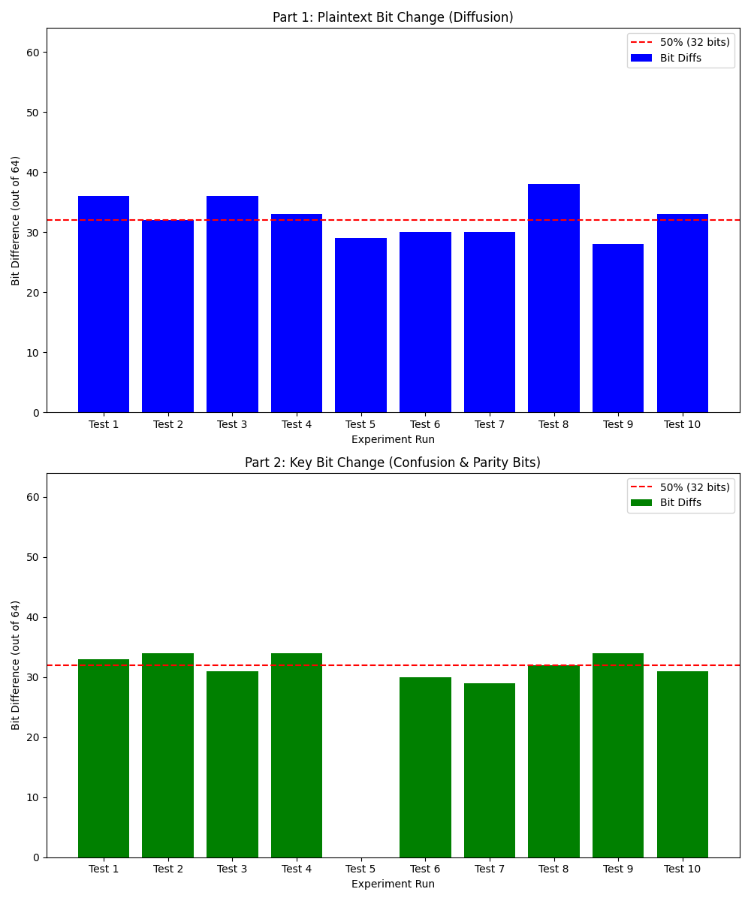

# Cryptography
## DES Analysis

## Part 1: Avalanche Effect on Plaintext (Diffusion) ---
- Test ............ Flipped Bit Pos .........New Ciphertext (hex) ......... Bit Difference
- Test 2  ...................... 31 ........... 5edc8ef2d1b231a2 ...................... 33
- Test 3  ...................... 39 ........... 87f884ee7f73403e ...................... 35
- Test 1  ...................... 19 ........... 0c9f4d7c435a0dee ...................... 37
- Test 4  ......................  7 ........... 94da1732d57482d8 ...................... 34
- Test 5  ...................... 59 ........... ed57d110997f104f ...................... 33
- Test 6  ...................... 11 ........... e4c17cf4860db0d4 ...................... 30
- Test 7  ...................... 63 ........... db0b21e37ba449b8 ...................... 38
- Test 8  ...................... 36 ........... 45e4e98220ab2a6b ...................... 36
- Test 9  ...................... 34 ........... c0bfe801846fa89a ...................... 33
- Test 10 ...................... 58 ........... 4db25ab79298649e ...................... 32
------------------------------------------------------------

## Part 2: Avalanche Effect on Key (Confusion) ---
- Test .............Flipped Bit Pos .........New Ciphertext (hex) ......... Bit Difference
- Test 1  ...................... 29 ........... 604eac3a49a27576 ...................... 42
- Test 2  ...................... 20 ........... b950dccbbb668433 ...................... 33
- Test 3  ...................... 33 ........... 880efcda13155d37 ...................... 36
- Test 4  ...................... 41 ........... 7eb8f0cb8262d876 ...................... 33
- Test 5  ...................... 36 ........... 7ec3813c842c1106 ...................... 35
- Test 6  ......................  1 ........... addf3a41fc2e26ec ...................... 24
- Test 7  ......................  0 ........... fe841e45bc79fead ......................  0
- Test 8  ...................... 26 ........... 77a5cef6340009a1 ...................... 29
- Test 9  ...................... 61 ........... adc7753e24934c0e ...................... 34
- Test 10 ...................... 59 ........... 15b24af91854268e ...................... 32
------------------------------------------------------------

## Part 3: Generating Charts ---
### Charts successfully saved to 'des_avalanche_analysis.png'
### Experiment complete.
